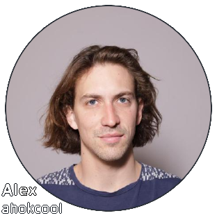
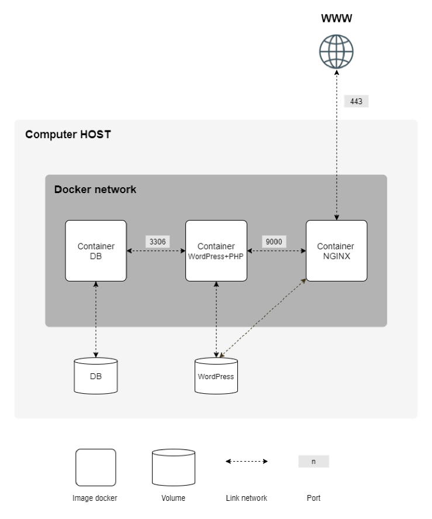

<!-- ahokcool HEADER START-->
---

   
  An overview of all my projects can be found here: <a href="https://github.com/ahokcool/ahokcool/blob/main/README.md" target="_blank">ahokcool</a>  
   
  This project was created as part of my studies at: <a href="https://www.42lisboa.com" target="_blank">42 Lisboa</a> 

---
<!-- ahokcool HEADER END-->
<!-- PROJECT HEADER START -->
 

  
  <h1 align="center">inception</h1>

	creating a docker network with multiple services in a virtual machine

 
<!-- PROJECT HEADER END -->

## :bulb: Lessons learned
- Setting up a virtual machine (debian)
- Using docker, docker-compose and dockerhub
- Setting up a docker network with shared docker volumes
- Installing and configuring a web server (nginx)
- Installing and configuring a database server (mariaDB)
- Installing and configuring a CMS (wordpress)

<!-- ahokcool FOOTER-->
---

  <a href="#top">🔝 back to top 🔝</a>

